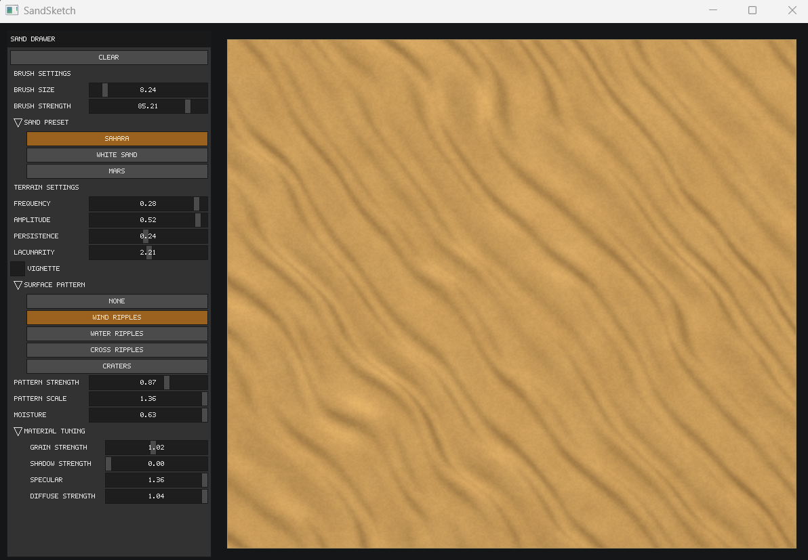
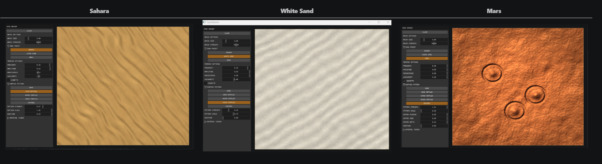
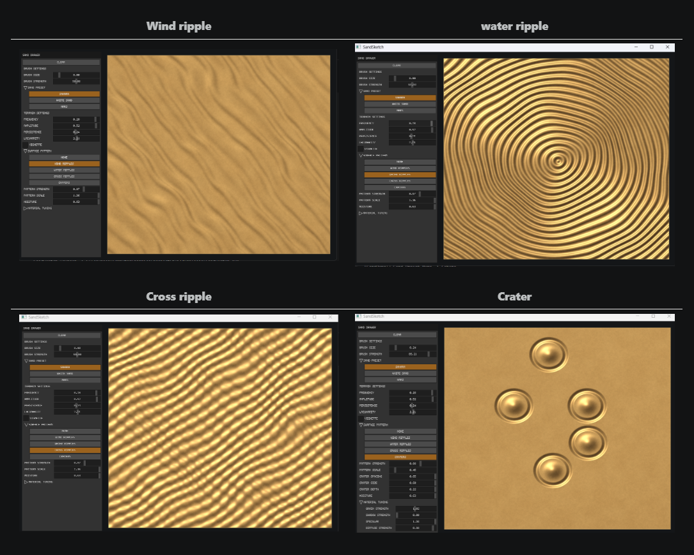
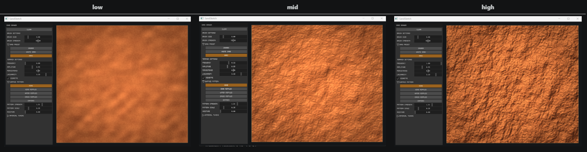
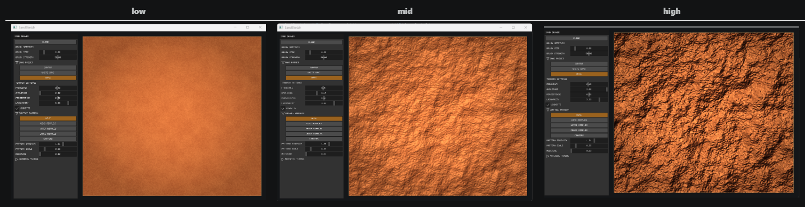
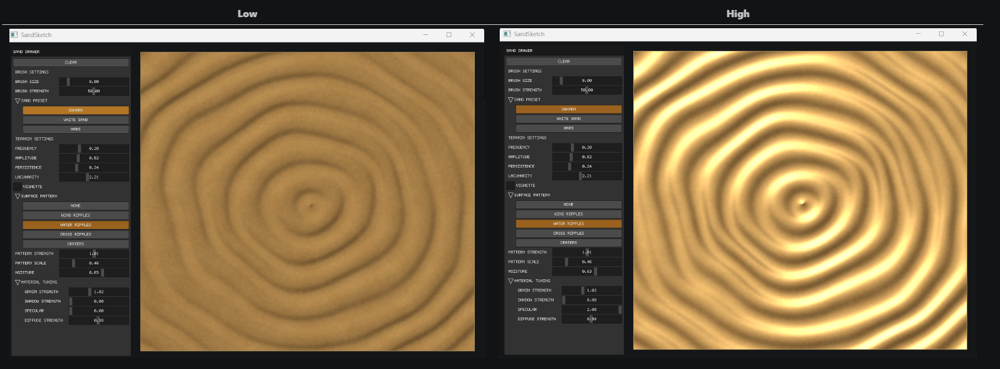
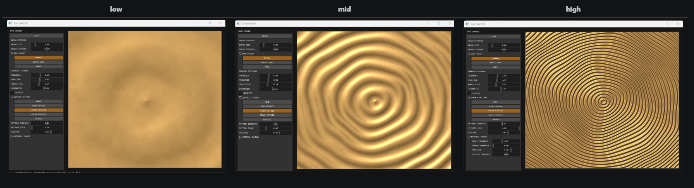

# SandSketch

SandSketch is an interactive application for creating and sketching procedural sand terrain in real time.

## Features

* Procedural sand terrain
* Multiple terrain presets
* Surface patterns
* Mouse sketching
* Adjustable terrain, pattern, and brush settings

## Getting Started

### Build and Run

```powershell
.\build_and_runS.ps1
```

## Using the Application
* Select a Sand Preset to load a complete terrain configuration.
* Adjust the Terrain Settings sliders to customize the terrain.
* Choose a Surface Pattern to change the detail pattern.
* Use Pattern Strength and Pattern Scale to control the pattern appearance.
* Use the Material sliders to adjust the sand appearance.
* Adjust Brush Size and Brush Strength to control sculpting.
* Click and drag with the left mouse button to sculpt the terrain.
* Click Clear to remove all brush edits.

## Technical Overview
SandSketch is a C++ application for generating and sculpting procedural sand terrain in real time. The project is organized into two main modules: Rendering and UI.


## Project Layout
SandSketch


```text
SandSketch/
│
├── CMakeLists.txt
├── build_and_runS.ps1
├── README.md
│
├── src/
├── main.cpp
├── SandCanvas.*
├── SandSimulation.*
├── TerrainSetting.h
├── ui/
│   ├── SandPanel.*
│   └── panel_controls.h
│
├── renderer/
│   ├── Renderer.*
│   ├── bridge_ui.*
│   └── microui/
│
└── build/
```
## Project Structure

- **main.cpp** – Application entry point.
- **SandCanvas** – Generates and edits the procedural sand terrain.
- **SandSimulation** – Handles sand simulation and terrain updates.
- **TerrainSettings** – Terrain presets and configurable parameters.
- **renderer/** – Rendering system and UI bridge.
- **ui/** – User interface components and controls.

The application uses procedural noise to generate terrain and applies lighting and color to create the final sand appearance. It uses **MiniFB** for the window, **microui** for the interface, **GLM** for math, and **CMake** for building the project.

## Screenshots
<u> **UI Overview:** </u><br>
 

<u>**Preset Comparison:**</u><br>


<u>**Pattern Comparison:**</u><br>


<u>**Frequancy:**</u><br>


<u> **Amplitude:** </u><br>


<u>**Specular Strength:**</u><br>


<u>**pattern scale:**</u><br>


## Demo

**Skatching demonstration:**
https://github.com/user-attachments/assets/62b04bdb-b423-426d-8694-3347b1160f32


